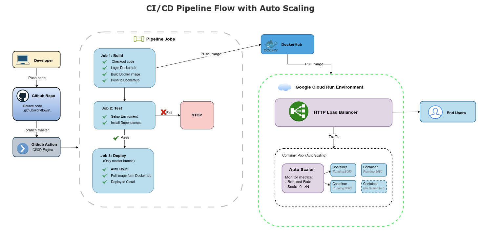

# 🦉 Golden Owl DevOps Internship - Technical Test

This repository is my submission for the **Golden Owl DevOps Internship Technical Test**. It demonstrates a complete CI/CD pipeline built with **GitHub Actions**, **Docker**, and **Google Cloud Run**.

The challenge required implementing a continuous integration and deployment workflow that automatically tests and deploys a containerized Node.js application to Google Cloud Run.

---

## 🌟 Mission Overview

The goal of this project is to:

1. **Fork** the original repository: [https://github.com/hoangnguyen02/goldenowl-devops-internship-challenge](https://github.com/hoangnguyen02/goldenowl-devops-internship-challenge)
2. **Dockerize** a Node.js application.
3. **Implement an automated CI/CD pipeline** using **GitHub Actions**.
4. **Run CI tests** automatically when changes are pushed to any `feature/*` branch.
5. **Deploy automatically (CD)** to **Google Cloud Run** when merged into the `master` branch.

---

## 🐳 Dockerization

The Node.js application was containerized using Docker to ensure a consistent runtime environment. The following Dockerfile defines the build process:

```Dockerfile
FROM node:18-alpine

WORKDIR /app

COPY src/package*.json ./
RUN npm install --production

COPY src .

EXPOSE 3000
CMD ["npm", "start"]
To build and run the application locally, execute the following commands:
```
docker build -t goldenowl-app .
docker run -p 3000:3000 goldenowl-app
Once running, test it using:

curl http://localhost:3000
→ {"message":"Welcome warriors to Golden Owl!"}
This confirms the application is working correctly inside a Docker container.
---
## ⚙️ CI/CD Workflow
The continuous integration and deployment workflow is implemented using GitHub Actions. The workflow is triggered automatically on code pushes and branch merges.

The pipeline consists of three main jobs:

Build – Builds the Docker image from the Dockerfile and pushes it to DockerHub.

Test – Installs dependencies and runs npm test to validate the application logic.

Deploy – Deploys the latest Docker image to Google Cloud Run when changes are merged into the master branch.

The CI/CD pipeline file is located at .github/workflows/deployment.yml.

For branch logic:

Any branch matching feature/* triggers CI only (Build + Test).

The master branch triggers the full CD process (Build + Test + Deploy).
---

## ☁️ Deployment
The application is deployed using Google Cloud Run, a fully managed serverless platform that automatically scales containerized applications based on incoming requests.

Cloud Run provides:

✅ Built-in Load Balancing

⚡ Auto Scaling from zero to many container instances

🔒 Public HTTPS endpoint

The deployment command is automated in the pipeline using:

bash
Sao chép mã
gcloud run deploy goldenowl-app \
  --image docker.io/hoangnguyen02/goldenowl-app:latest \
  --region us-west4 \
  --platform managed \
  --allow-unauthenticated \
  --min-instances 1 \
  --max-instances 10 \
  --concurrency 50 \
  --cpu 1 \
  --memory 512Mi
This configuration ensures Cloud Run keeps at least one warm container running (--min-instances 1) for fast responses, can scale up to 10 instances under heavy load, and each container can process up to 50 concurrent requests.

After deployment, the live app is available at:
🔗 https://goldenowl-app-981542288355.us-west4.run.app/

Expected response:

json
Sao chép mã
{"message": "Welcome warriors to Golden Owl!"}
---

## 📈 Auto Scaling & Load Balancer
Google Cloud Run uses Knative-based autoscaling to automatically manage container instances. When traffic increases, Cloud Run dynamically spawns new containers across Google’s managed infrastructure. When requests drop, it automatically scales down — even to zero when idle — saving cost.

Each Cloud Run service is placed behind a Google Cloud Load Balancer (GCLB), which routes incoming requests to available containers using latency-based load distribution. This ensures high availability, even during sudden spikes in traffic.

Autoscaling is controlled primarily by three parameters:
--min-instances: minimum number of active containers (avoid cold starts)
--max-instances: maximum container limit to control cost
--concurrency: maximum number of concurrent requests per container
Example: If concurrency=10 and 100 simultaneous requests arrive, Cloud Run will automatically spin up 10 containers and distribute traffic evenly.

---

## 🧭 CI/CD Pipeline Overview
<p align="center">  </p>
The diagram above illustrates the workflow:

Developer pushes code to GitHub
GitHub Actions triggers the pipeline (Build → Test → Deploy)
The Docker image is built and pushed to DockerHub
Cloud Run pulls the latest image and deploys it automatically
Traffic is routed through Google Cloud Load Balancer
Cloud Run scales up or down based on real-time request volume
---

## 🧠 Summary
This project demonstrates a modern DevOps workflow integrating GitHub Actions, Docker, and Google Cloud Run to achieve continuous integration and deployment.
---